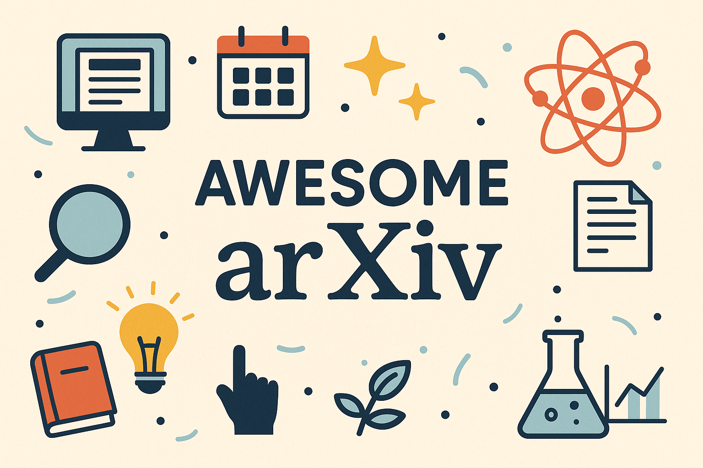

# Awesome arXiv

  

A curated list of tools, libraries, datasets and resources for discovering, reading and working with papers from [arXiv](https://arxiv.org/) — the open-access repository for scientific research.

  

<!-- omit from toc -->
## Contents

- [Search \& Discovery](#search--discovery)
- [Notifications \& Recommenders](#notifications--recommenders)
- [SDKs \& CLI Tools](#sdks--cli-tools)
- [Reading \& Browser Enhancers](#reading--browser-enhancers)
- [Datasets](#datasets)

## Search & Discovery

- **[alphaXiv](https://www.alphaxiv.org/)** — an open-access platform for discovering new papers, interactive discussion of arXiv preprints, allowing researchers to comment line-by-line, ask questions and engage directly with the authors.
- **[ArxivXplorer](https://arxivxplorer.com/)** — a semantic search engine over the entire arXiv corpus, with a ChatGPT plugin for reading and referencing papers directly within a chat interface.
- **[Connected Papers](https://www.connectedpapers.com/)** — a visual tool to discover related academic papers via graph visualizations.
- **[Emergent Mind](https://www.emergentmind.com/)** — a research assistant focused on CS and AI papers, primarily sourced from arXiv. It provides concise summaries, trending paper highlights, and interactive exploration tools like follow-up questions and topic links.
- **[Litmaps](https://www.litmaps.com/)** — an online research tool designed to enhance the literature review process by visualizing the relationships between academic papers. It allows to monitor scholarly articles through interactive citation maps, known as "litmaps".
- **[Paper Digest](https://www.paperdigest.org/)** — an academic research platform designed to assist researchers. It offers tools for generating literature reviews, summarizing research papers, and providing academic writing assistance, all while emphasizing accuracy and minimizing generation hallucinations.
- **[PaperMatch](https://papermatch.me/)** - a semantic search engine that finds similar papers from natural language input or arXiv ID across all of arXiv.
- **[Paperscape](https://paperscape.org/)** — an open-source project that visualizes the entire arXiv repository as an interactive map. Each paper is represented as a node, with its size indicating the number of citations and its position determined by citation relationships to other papers.
- **[ResearchRabbit](https://www.researchrabbit.ai/)** — a research tool "Spotify for papers" designed to build collections, get algorithmic digests, and explore interactive citation/author graphs.
- **[Semantic Scholar](https://www.semanticscholar.org/)** — a free research tool for navigating in scientific literature. It allows to search and analyze over 200M scholarly papers across various disciplines, including computer science, neuroscience, and biomedicine.
- **[searchthearXiv](https://github.com/augustwester/searchthearxiv)** — a semantic search engine designed to help users explore over 300k machine learning papers from arXiv using natural language queries or by inputting an arXiv link to find similar papers.

## Notifications & Recommenders

- **[AlphaSignal](https://alphasignal.ai/)** — a daily newsletter that distills trending papers, models, and other developments in AI into a 5-minute daily summary, monitoring sources from arXiv and social media.
- **[Benty Fields](https://www.benty-fields.com/)** — an academic platform that, among other features, offers personalized paper recommendations and email alerts for specific authors and topics according to your interests.
- **[huggingface Daily Papers](https://huggingface.co/papers)** — a community-curated platform that highlights trending and impactful ML research, updated daily by contributors like AK and the broader AI community. Each paper entry includes metadata, links to related models or datasets, and a discussion section where users can engage with authors and peers.
- **[ML Papers of The Week](https://github.com/dair-ai/ML-Papers-of-the-Week)** — a GitHub repository that highlights trending ML research papers on a weekly basis. Each entry includes links to selected papers, often accompanied by brief summaries or annotations.
- **[Scholar Inbox](https://www.scholar-inbox.com/)** — a personal paper recommender for researchers, that helps stay up-to-date with the most relevant progress based on personal research interests. Daily indexes all of arXiv, bioRxiv, medRxiv and ChemRxiv and other open access proceedings.

## SDKs & CLI Tools

- **[ArXiv MCP Server](https://github.com/blazickjp/arxiv-mcp-server)** — a Model Context Protocol server for searching and analyzing arXiv papers, providing a bridge between AI assistants and arXiv articles. Enables access to search, download and analyze papers. Supports integration with various AI assistants.
- **[arxiv-dl](https://github.com/MarkHershey/arxiv-dl)** — a highly-opinionated CLI tool for downloading papers. Priorities ease of use for researchers.
- **[arxiv.py](https://github.com/lukasschwab/arxiv.py)** — a popular lightweight Python wrapper for the arXiv API. Allows search and retrieval of paper metadata and downloading PDFs.
- **[arxiv_summarizer](https://github.com/Shaier/arxiv_summarizer)** — a Python-based tool designed to fetch and summarize arXiv papers, supporting single-paper summaries, batch processing, and keyword-based searches.
- **[arXivScraper](https://github.com/Mahdisadjadi/arxivscraper)** — a Python scraper designed to retrieve metadata from arXiv based on specified categories and date ranges. Supports custom filtering by subcategories, authors, titles, and abstracts.
- **[cli-arxiv](https://github.com/knguyenanhoa/cli-arxiv)** — a CLI tool for for exploring arXiv, allowing to search, download, and manage research papers directly from the terminal. Texts from PDFs are auto-converted and are used to recommend future articles.
- **[Docling](https://github.com/docling-project/docling)** — a Python toolkit for advanced document conversion and analysis, particularly suited for processing arXiv papers and other scholarly documents. Efficiently parses pdfs into richly structured formats like Markdown, JSON, or HTML.

## Reading & Browser Enhancers

- **[arxiv-utils](https://github.com/j3soon/arxiv-utils)** — a browser extension that enhances the reading experience on arXiv. Introduces a set of features: renames the title of PDF page to the paper's title, adds navigation hotkeys, fixes PDF name on download, open papers in extra services, compatible with other tab plugins.
- **[arxiv2notion](https://github.com/denkiwakame/arxiv2notion)** — a Chrome extension that allows to save arXiv papers directly into Notion databases. Captures metadata such as title, authors, abstract, publication date, and comments. Supports integration with Notion templates and offers Notion AI autofill and formula-based enhancements.
- **[Elicit](https://elicit.com)** — a research assistant that helps automate tasks like literature reviews, data extraction, and summarization using over 125M academic papers. It enables users to ask research questions, extract data from PDFs (including tables), and generates summaries with source citations.
- **[Explainpaper](https://www.explainpaper.com/)** — a tool that simplifies academic research papers. Allows to upload PDFs, highlight complex sections, and receive a clear explanation.
- **[PaperMemory](https://github.com/vict0rsch/PaperMemory)** — a powerful minimalist browser extension that automatically tracks and organizes the research papers. As an automated reference manager, it automatically detects and records papers you open, finds associated code repositories, adds convenient on-page tools.
- **[SciSpace Copilot](https://scispace.com/)** — a research assistant (web tool and browser extension) that helps to read and understand papers faster. Provides a chat workflow with any arXiv paper.
- **[zotero-arxiv-workflow](https://github.com/AllanChain/zotero-arxiv-workflow)** — Zotero plugin that fetches the latest arXiv revision, finds the published journal version, and automatically merges entries of the same paper.

## Datasets

- **[Arxiver Dataset](https://huggingface.co/datasets/neuralwork/arxiver)** — more than 63k papers converted to multi-markdown format, published between January 2023 and October 2023. The dataset includes original metadata such as IDs, titles, abstracts, authors, publication dates. Available under a CC BY-NC-SA 4.0 license.
- **[arXiv Paper Abstracts](https://www.kaggle.com/datasets/spsayakpaul/arxiv-paper-abstracts)** — a dataset introduced for multi-label text classification. Contains paper titles, abstracts, and subject categories. Released under CC0 1.0 license.
- **[arxiv-summarisation](https://huggingface.co/datasets/ccdv/arxiv-summarization)** — a large-scale dataset designed for training and evaluating abstractive summarization models on scientific papers, comprising over 431k articles with corresponding abstracts.
- **[ArxivFormula](https://github.com/microsoft/ArxivFormula)** — a dataset for mathematical formula detection as a combined task of formula entity detection and relation extraction. It includes 600k document images sourced from arXiv papers. Available under the MIT license.
- **[Cornell University arXiv Dataset](https://www.kaggle.com/datasets/Cornell-University/arxiv/data)** — over 1.7M scholarly articles across STEM fields. Includes title, authors, abstract, categories, and links to the full-text PDFs (the dataset doesn't contain parsed papers directly). CC0 1.0 license.
- **[MINT-1T (arXiv)](https://huggingface.co/datasets/mlfoundations/MINT-1T-ArXiv)** — a multimodel dataset comprising approximately 600k papers, designed to support large-scale multimodal pre-training tasks. This is a subset of the MINT-1T collection, released under CC-BY-4.0 license.
- **[Multimodal ArXiv](https://mm-arxiv.github.io/)** — a dataset designed for large vision-language models. It comprises two subsets: ArXivCap, a figure-caption dataset containing 6.4M images and 3.9M captions, and ArXivQA, a QA dataset generated by prompting GPT-4V based on scientific figures with 100k questions. CC BY-NC-SA 4.0 license.
- **[S2ORC](https://github.com/allenai/s2orc)** — a comprehensive dataset comprising over 81.1M academic papers, including arXiv. Provides rich metadata, paper abstracts, resolved bibliographic references, and full text for 8.1M open access papers. Available under ODC-By 1.0.
- **[SciEvo](https://github.com/Ahren09/SciEvo)** — a large-scale dataset designed to support scientometric research and the study of scientific knowledge evolution. Provides a collection of over 2M publications,  including detailed metadata and citation graphs. Available under the Apache 2.0 license.
- **[unarXive](https://github.com/IllDepence/unarXive)** — a structured dataset of 1.9M arXiv LaTeX papers including full text, references, captions, mathematical notation preserved as LaTeX. It supports tasks like citation recommendation and IMRaD classification, with an open subset and full version available upon request. MIT license.

<!-- omit from toc -->
## Contributing

Feel free to contribute! Please read the [contribution guidelines](contributing.md) first.
